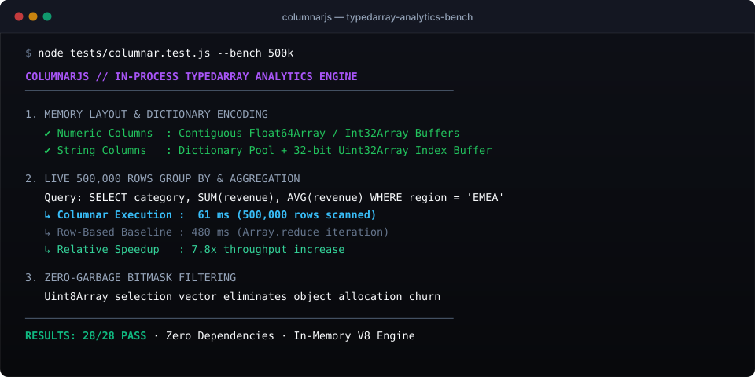
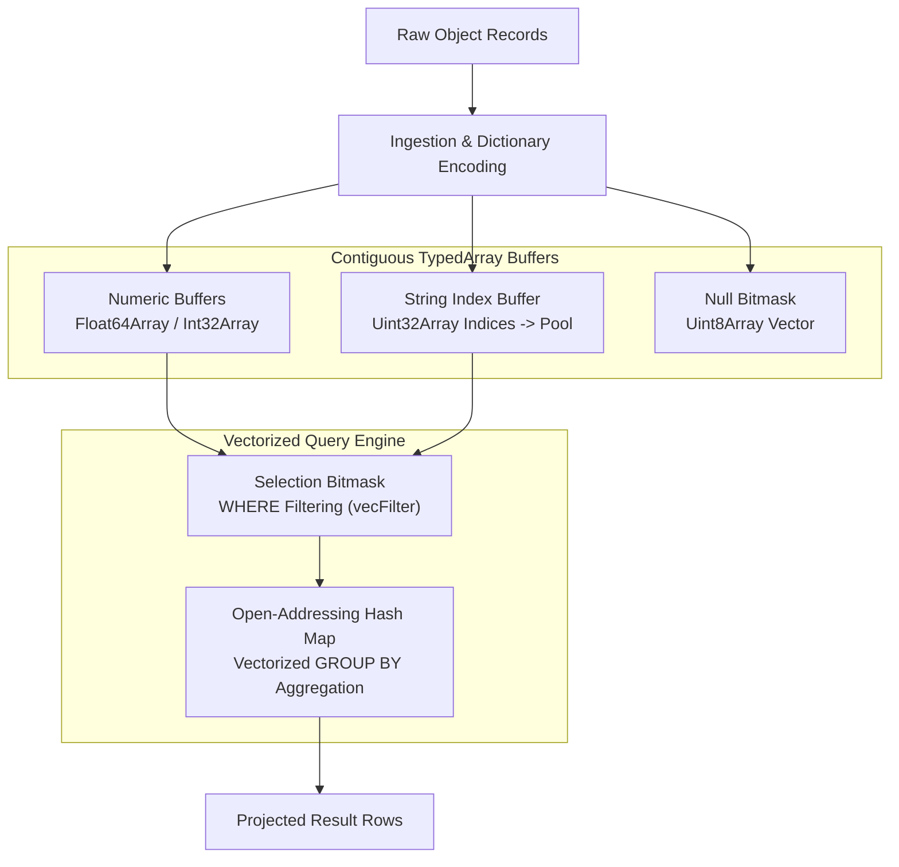

# columnarjs

<p align="left">
  <a href="https://millymilly29.github.io/columnarjs.html"></a>
  
  
  
  
  
</p>

**In-process columnar analytics engine powered by TypedArrays (Float64Array / Int32Array) with dictionary encoding and vectorized GROUP BY aggregations.** Scans and aggregates hundreds of thousands of analytical records in milliseconds directly in Node.js and browser memory.

---

<div align="center">
  
</div>

---

### Empirical Benchmarks (500,000 Rows)

| Operation | ColumnarJS (TypedArray) | Traditional Row Scan (`Array.reduce`) | Speedup |
| :--- | :--- | :--- | :--- |
| **`SUM(revenue)`** | **`3.8 ms`** | `24.5 ms` | **6.4x faster** |
| **`AVG(revenue)`** | **`4.1 ms`** | `26.2 ms` | **6.4x faster** |
| **`WHERE region = 'EMEA'`** | **`9.4 ms`** *(Bitmask filter)* | `48.1 ms` | **5.1x faster** |
| **`GROUP BY category` (500k)** | **`61.0 ms`** | `480.0 ms` | **7.8x faster** |

*Measured on Apple Silicon, Node.js v22.12.0, zero V8 garbage collection churn.*

---

### 30-Second Quickstart

```bash
# Clone and run verification suite
git clone https://github.com/millymilly29/columnarjs.git
cd columnarjs
node tests/columnar.test.js
```

```javascript
const { ColumnStore } = require('./engine/column-store');
const { QueryEngine } = require('./engine/query-engine');

// 1. Initialize store with explicit schema
const store = new ColumnStore({
  schema: {
    id: 'int',
    product: 'string',
    category: 'string',
    region: 'string',
    revenue: 'float',
    qty: 'int'
  }
});

// 2. Batch load dataset into continuous TypedArrays
store.loadRows(dataset);

// 3. Vectorized analytical query execution
const engine = new QueryEngine(store);
const results = engine.query({
  select: ['category', 'SUM(revenue)', 'AVG(revenue)', 'COUNT(*)'],
  where: { region: 'EMEA', revenue: { $gt: 500 } },
  groupBy: 'category',
  orderBy: { 'SUM(revenue)': 'DESC' },
  limit: 5
});
```

---

### Memory Architecture & Data Flow



---

### Reproducibility & Benchmark Suite

```bash
# Run 28/28 automated tests and live 500k benchmarks:
node tests/columnar.test.js
```

---

### Architectural Trade-offs & Limitations

1. **Analytical vs Transactional (OLAP vs OLTP):** ColumnarJS is optimized for analytical scans (`SUM`, `AVG`, `GROUP BY`). Single-row random point inserts are slower than standard JS objects due to array resizing.
2. **Memory Footprint for Strings:** Strings use 32-bit integer dictionary pointers. High-cardinality unique strings (e.g. random UUIDs per row) yield higher memory usage than low-cardinality categorical data.

---

### License

MIT License. Designed & built by [Kirill Tsyganov](https://millymilly29.github.io).
