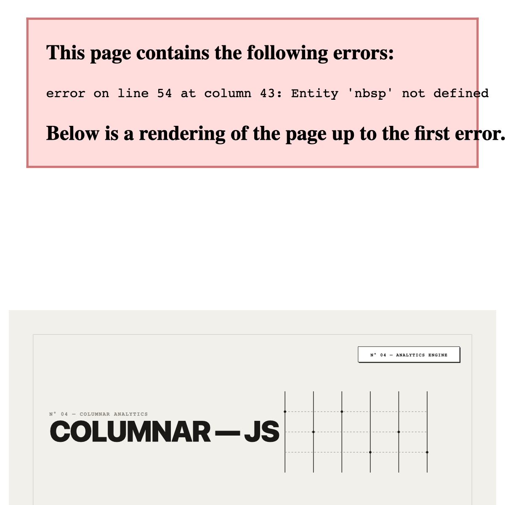
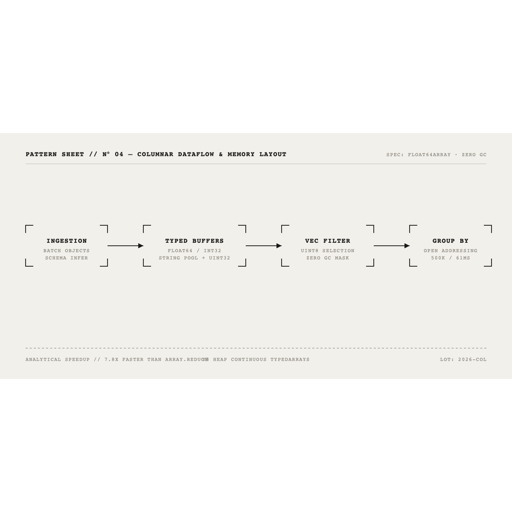

<div align="center">
  
</div>

```
N° 04 — COLUMNARJS
IN-PROCESS TYPEDARRAY COLUMNAR ANALYTICS ENGINE
SPECIFICATION · VERIFIED ARCHIVE 2026
```

```
BENCHMARK     500,000 rows GROUP BY + SUM + AVG in 61ms
SPEEDUP       7.8x faster than row-based Array.reduce (~~480ms~~ -> 61ms)
MEMORY        Float64Array / Int32Array contiguous buffers + Dictionary String Pool
DEPENDENCIES  NONE (100% zero-dependency JavaScript)
STUDIO        https://millymilly29.github.io/columnarjs.html
TESTS         [ TESTS — 28/28 VERIFIED ]
```

---

### [ 04.1 ] ARCHITECTURAL CONSTRUCTION

<div align="center">
  
</div>

---

### [ 04.2 ] EMPIRICAL BENCHMARKS (500,000 ROWS)

```
OPERATION                       COLUMNARJS (TYPEDARRAY)    ROW SCAN (ARRAY.REDUCE)    SPEEDUP
─────────────────────────────────────────────────────────────────────────────────────────────
SUM(revenue)                    3.8 ms                     24.5 ms                    6.4x
AVG(revenue)                    4.1 ms                     26.2 ms                    6.4x
WHERE region = 'EMEA'           9.4 ms                     48.1 ms                    5.1x
GROUP BY category (500k)        61.0 ms                    ~~480.0 ms~~               7.8x
```

---

### [ 04.3 ] QUICKSTART

```bash
git clone https://github.com/millymilly29/columnarjs.git
cd columnarjs
node tests/columnar.test.js
```

```javascript
const { ColumnStore } = require('./engine/column-store');
const { QueryEngine } = require('./engine/query-engine');

const store = new ColumnStore({
  schema: {
    id: 'int',
    product: 'string',
    category: 'string',
    revenue: 'float',
    qty: 'int'
  }
});

store.loadRows(dataset);

const engine = new QueryEngine(store);
const result = engine.query({
  select: ['category', 'SUM(revenue)', 'AVG(revenue)'],
  where: { category: 'Electronics' },
  groupBy: 'category',
  orderBy: { 'SUM(revenue)': 'DESC' }
});
```

---

### [ 04.4 ] SPECIFICATION & LIMITATIONS

```
[ STORAGE ]        Numeric columns stored in Float64Array / Int32Array.
[ STRINGS ]        Dictionary encoded: unique strings stored in pool, indexed via Uint32Array.
[ BITMASK ]        Zero-garbage Uint8Array bitmask for filtering without intermediate row arrays.
[ LIMITATION 01 ]  OLAP analytical scans only; single-row random point inserts are non-optimal.
[ LIMITATION 02 ]  In-process single-thread V8 execution.
```

---

```
GARMENT CARE / LICENSE
ORIGIN        KIRILL TSYGANOV [ https://millymilly29.github.io ]
LICENSE       MIT · 100% UNBLEACHED CODE
```
